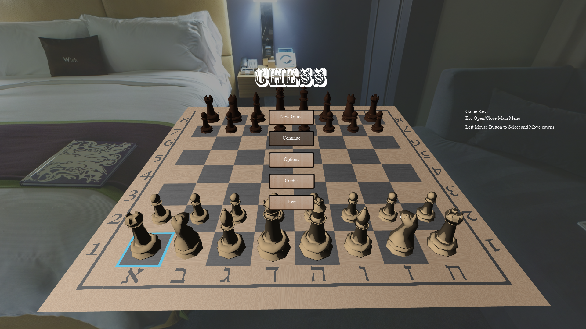

# 3D Chess
A cross platform Chess game for 2 players made using OpenGL and c++.

## Screenshot

## Controls
| Key | Symbol |
| --- | --- |
|ESC| open/close the main menu |
|Left mouse button| select what game piece to move and to where |

## Building Dependencies
* Cmake(at least 3.2) and a C++11 or better compiler  
* In order to build the project the following libraries are required:   
  * boost  
  * freeType2  
  * GLEW  
  * libpng  
  * libjpeg or libjpeg-turbo 
  * fbx-sdk  
  
* For linux it also required to have:  
  * libx11  
  * libxrandr  
  * wayland-protocols
  * Fontconfig  
  * xkbcommon

## Bug Report
Any bugs you come by please send to xmakerenx@gmail.com.

## Credits

* Game made By : Matan Keren.  
* Game Pieces were made By : Adin Schnall  
* GUI Textures were made By : www.medialoot.com  
* SkyBox Textures made By : Emil Persson www.humus.name  
